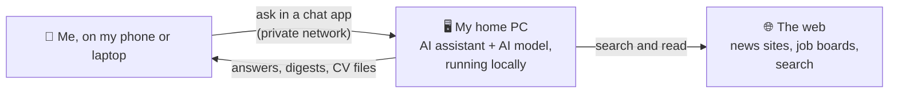
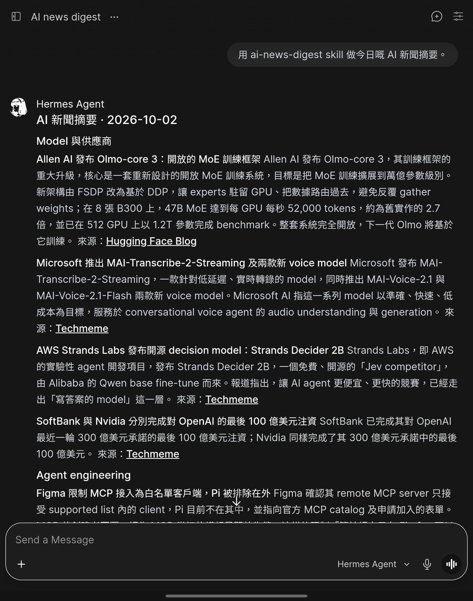
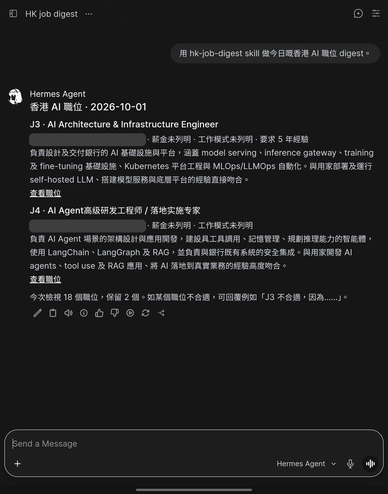
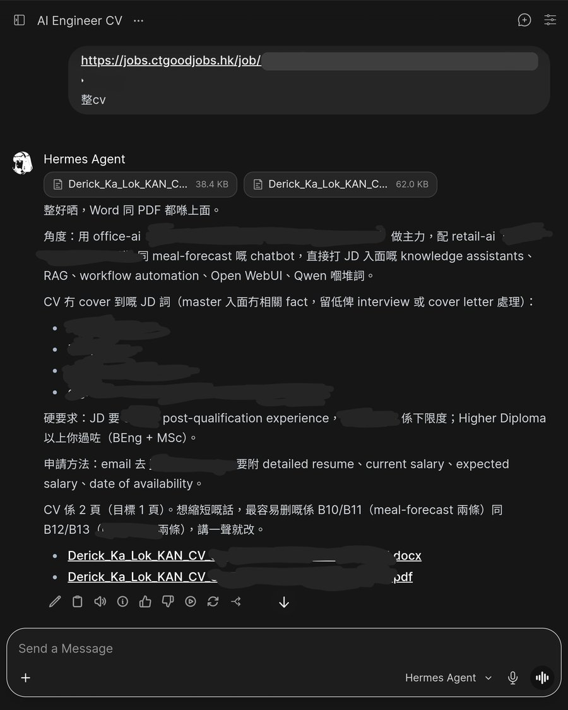
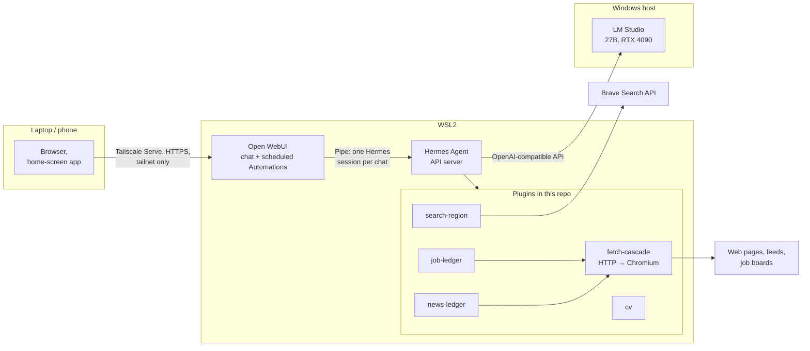

# hermes-harness

**A personal AI assistant that runs on my own PC: it reads the web for me, posts a daily AI news digest and new Hong Kong job ads to my phone, and writes a CV tailored to each job.**

Derick Kan · AI engineer, Hong Kong · [GitHub](https://github.com/derickkan3356) · [LinkedIn](https://www.linkedin.com/in/derick-kan-131292204) · derickkan7@gmail.com

First version built in one month, 1 Sep – 2 Oct 2026 (60 commits in the private repo).

[中文版](README.zh-Hant.md)

> **A showcase, not a product.** This is a snapshot of the private repo I use every day, published to show my work. It is tied to my own hardware and I do not support running it elsewhere. Personal files are replaced with made-up examples; see [What is real here](#what-is-real-here).

## What it does

| Every morning | On request |
| --- | --- |
| **AI news digest.** About 90 new items from 30 sources each day, cut to the 8–10 stories worth reading, written in Chinese, each with its link. | **A CV for one job.** Paste a job ad; get a Word and a PDF CV that use the ad's own terms, built only from facts I wrote down. Ask for changes in the same chat. |
| **Hong Kong job digest.** New ads from JobsDB and CTgoodjobs, with the ones that are certainly wrong for me dropped, and the rest judged against what I want. | **Web questions.** Search and read pages, including ones that need a real browser, and answer with sources. |

| AI news digest | HK job digest | A CV for one job |
| --- | --- | --- |
|  |  |  |

Screenshots from my phone; click one to see it larger. Company names, the job link and details of the application are hidden.

## Why not just ask ChatGPT?

ChatGPT is a smart generalist. It answers a little differently every time, and you have to check its work. That is fine for one question. A job that runs every day has to be **repeatable, checkable and safe**, and that is the engineering around the model, not the model.

The rule I build by: **code does whatever a fixed rule can do reliably, and the AI makes the judgement calls.** Code fetches the pages, removes duplicates, filters out what is certainly wrong, and checks the AI's output. The AI decides what matters and writes it. That split is why a smaller model running on one PC is enough.

| What you get | How | Measured here |
| --- | --- | --- |
| **Reliable** | Keeping track of what was already posted is done by code, not by the AI. | When the AI kept the list, it got it wrong 2 times out of 2. With code: right 2 out of 2, and no repeated story across five days of digests. |
| **No made-up facts** | Every number on a CV must exist in the facts it cites; code checks it before the file is made. | Four CVs for real job ads: no number outside the facts. In the news digests, every figure checked (21 in the first one) was in the sources read. |
| **Faster** | Digests are ready at 07:00 before I look. A follow-up question reuses what was already read. | A follow-up answered in **2 s** with no new search, against **33 s** for the first answer. |
| **Less for the AI to wade through** | Code drops what is certainly wrong before the AI reads anything. | One day's pull: 256 job ads → 55 left for the AI to judge. |
| **Safe** | The chat app reaches only tools that take data (a link, a search, a date). It has no tool that runs commands, so a malicious web page has nothing to hijack. | It started with a real incident (19 Sep 2026): I typed "laptop test" in the chat, and the assistant took it as a request to benchmark the computer. It ran CPU and memory tests and wrote 4 GB to disk. Two of its commands were flagged as dangerous, and the AI model itself judged them safe to run. A safety check is only as good as whoever makes the call, so the capability was removed, not filtered. ([record](.cursor/plans/security.plan.md)) |
| **Private** | The AI model runs on my own GPU. My CV and job search never go to a cloud AI. | No cloud AI model is used at all, not even as a backup. |

The last row is the one that matters for many Hong Kong employers. Banks and other regulated firms often cannot send data to ChatGPT. This repo shows how to make a smaller, self-hosted model dependable: the work those teams need.

## What is real here

Everything in this repo is the real thing, copied from my private repo, except:

| File or value | What it is here |
| --- | --- |
| `cv/master.yaml` | A made-up person (Alex Chan) with made-up jobs, in the same format as my real CV facts. |
| `plugins/job_ledger/profile.yaml` | The rules, sources and lists are real. The wanted and unwanted work, the salary floor and the years of experience are examples. |
| Host names, network name, user name, private IP | Placeholders: `gpu-desktop-1`, `example-tailnet`, `user`, `100.64.0.2`. |
| `evals/jobs/labels/` | Removed: real job ads with my verdicts on them. The docs keep the numbers measured with them. |

The commit history starts fresh here; the private repo's history stays private. No license: you are welcome to read it, but all rights are reserved.

---

## For engineers

[Hermes Agent](https://github.com/NousResearch/hermes-agent) (Nous Research) as the agent, a 27B open-weight model at 4-bit on one RTX 4090 through LM Studio, Open WebUI as the chat on laptop and phone.

### Where to start reading

Nothing here is meant to be installed. To see how it was built, read in this order:

1. [CLAUDE.md](CLAUDE.md): the contract every agent session starts from.
2. [.cursor/plans/security.plan.md](.cursor/plans/security.plan.md): a finished plan. Each step is checked off with its evidence, and each rejected option points to where its reason now lives.
3. [docs/security.md](docs/security.md): where that plan's conclusions went.
4. [.cursor/plans/ai-news.plan.md](.cursor/plans/ai-news.plan.md): a plan still running, with its biggest unknown, one next step and a done-when.

For the code, start with [docs/web-fetch.md](docs/web-fetch.md) and then [plugins/fetch_cascade/](plugins/fetch_cascade/): the shared layer the use cases are built on.

### Design decisions

- **Local model only.** No cloud LLM, not even as a fallback. A task the local model cannot do is a task this harness does not do yet. ([CLAUDE.md](CLAUDE.md))
- **One fetch layer, many use cases.** `web_extract` escalates inside one backend (HTTP + trafilatura, then local Chromium) behind a shared quality gate. The news and job digests are built on it, never with their own fetchers. On 30 test URLs: 23 clean, 5 degraded, 2 failed, against a paid fetch API's 21 / 0 / 9. ([docs/web-fetch.md](docs/web-fetch.md))
- **The capability is absent, not gated.** The browser-facing platform gets data tools only: no shell, files, browser or code execution. Hermes' command blocklist is kept for the terminal, but it is not the boundary. ([docs/security.md](docs/security.md))
- **Code for fixed rules, the model for judgement, and code hands it clues.** A heuristic must not quietly drop an item before the model sees it. ([docs/ai-news.md](docs/ai-news.md), [docs/hk-jobs.md](docs/hk-jobs.md))
- **Measure before choosing.** The search provider (the keyless default failed most engines from a Hong Kong home line), relevance floors (labelled stories), the fetch layers and the CV checks each have an eval under [evals/](evals/).
- **A chat follows up with tool results in context.** A Pipe maps each Open WebUI chat to one Hermes session, so a follow-up sees the pages read before, not only the answer text. ([docs/open-webui.md](docs/open-webui.md))

### How it was built: agentic engineering

Most of the code was written by coding agents, Claude Code and Cursor. My work was three things:

- **Designing how the agents work.** The contract every session reads, one plan per workstream, the rule that a step is done only with evidence, and where a finished conclusion goes so the next session finds it.
- **Making the technical decisions.** What to build, where code ends and the model begins, which option the measurements support.
- **Reviewing what the agents produced.** Reading the diffs, checking each claim against command output or logs, and sending back work that looked done but was not.

**Context engineering.** A coding agent starts every session knowing nothing but what it reads. Most of the design is about what it reads: enough to act right, nothing stale, nothing it does not need. Each part of this repo answers one failure. "Agent" here means the coding agent, Claude Code or Cursor:

| Failure | What it looks like | What this repo does |
| --- | --- | --- |
| **Context drift** | A doc gives the address WSL uses to reach the Windows host; after a reboot the address is different. An agent that reads the doc connects to the old one. | Live state comes from [tools/facts.sh](tools/facts.sh) when needed. No doc, plan or rule file holds a number a script can print. |
| **Context rot** | A plan that keeps every finished step grows until the next step is buried. An agent attends worse as its context grows, even when what matters is in it. | A plan holds only running state: the biggest unknown, one next step, a done-when. Finished conclusions move to [docs/](docs/). One plan per workstream, and an agent reads only its own. |
| **An always-loaded file that grows** | Every rule anyone thought useful goes into `CLAUDE.md`, which every turn pays for. | [CLAUDE.md](CLAUDE.md) holds only what would make an agent act wrongly if missing. How-to is in `docs/`, read when the task needs it. |
| **History as noise** | "We moved this in September" tells a fresh agent nothing it can act on, and can send it after the old way. | Reference docs are written as if they had always looked this way. Git is the changelog. |
| **Lossy rewrites** | An agent rewrites a doc section and drops a fact nobody knew was load-bearing. | Change the sentences that changed; never rewrite a section. |
| **Settled questions reopened** | The next session proposes the option that was tested and rejected last week. | Every rejected option has its reason in `docs/`. Open questions stay in the closed plan as the next plan's backlog. |
| **"Done" that is not done** | The agent reports success on work that only looks finished. | A done-when is a command and its expected result. A step is checked off only with evidence: output or a log path. |
| **Two agents, two memories** | Claude Code keeps its own memory, which Cursor and git never see. | Agent memory is off; everything an agent learns lands in this repo, where both read it. |
| **Drift between files** | A change in one doc makes another one false, in a file nobody opened. | Before a plan closes, the agent reviews the whole repo against the rules. |
| **An agent that agrees** | The agent builds what was asked even when it is a bad idea. | My [user-level rules](agents/user-level-CLAUDE.md) tell it to push back and offer better options. |

Both Claude Code and Cursor read the same contract and plans, so either can pick up where the other stopped.

Four times I caught an agent's work going wrong:

- **It wrote down a decision our own test had ruled out** (17 Sep 2026). An agent recorded a search service as our backup, though our test had shown it answering a weather query with YouTube and a where-to-eat query with Netflix. It is recorded as rejected, with the reason. ([record](docs/web-search.md#rejected-providers))
- **It lost content quietly** (18 Sep 2026). I had the page reader save every page it read and compared them by hand with the real pages. It was dropping headlines from a news front page. After the fix, that page came back with 975 more characters, and no page in the test set got shorter. ([record](docs/web-fetch.md#images))
- **It made up work** (24 Sep 2026). An agent added a question to a plan about comparing a model nobody had mentioned. A plan is what the next session works from, so made-up work there becomes real work. I had it deleted without a trace, as the rules require, so there is no record to link.
- **It made a judgement in code** (30 Sep 2026). Code decided whether two news reports were the same story by how alike their headlines' model names were. That kept a real launch out of the digest because an older, different one had a similar name. Whether two reports are the same story is a judgement, so the AI makes that call now, and code hands it clues. That became the rule the whole project follows. ([record](.cursor/plans/ai-news.plan.md))

The last one is the same idea as [Why not just ask ChatGPT?](#why-not-just-ask-chatgpt), seen from inside.

### Map

| Path | |
| --- | --- |
| `plugins/` | Hermes plugins: typed tools, workers in their own `uv` environments |
| `skills/` | Agent procedures for the news digest, job digest and CV |
| `open-webui/` | The Pipe that maps a chat to a Hermes session |
| `config/` | Hermes config and persona |
| `cv/` | CV template, fonts, the master of facts |
| `evals/` | Search, fetch, feeds, relevance and job evals |
| `systemd/` | User units for the services that stay up |
