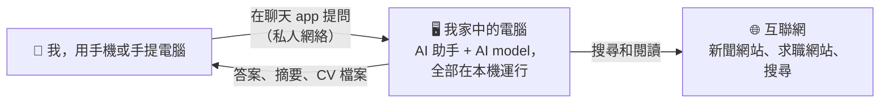
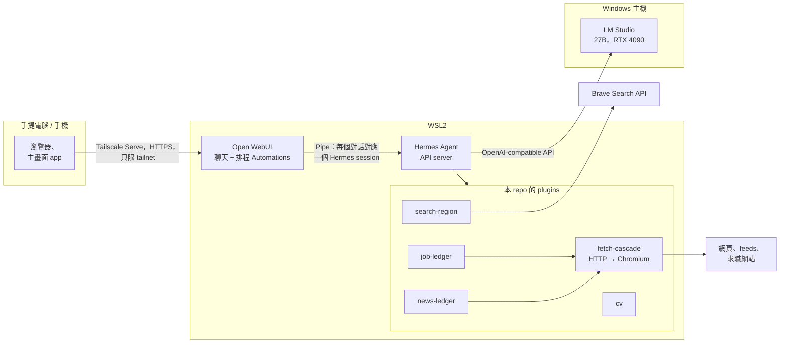

# hermes-harness

**一個在我自己電腦上運行的個人 AI 助手：替我搜尋和閱讀網頁，每天把 AI 新聞摘要和新的香港職位空缺送到我的手機，並按每份工作度身撰寫 CV。**

Derick Kan · AI Engineer，香港 · [GitHub](https://github.com/derickkan3356) · [LinkedIn](https://www.linkedin.com/in/derick-kan-131292204) · derickkan7@gmail.com

第一版用了一個月完成：2026 年 9 月 1 日至 10 月 2 日（private repo 中有 60 個 commit）。

[English](README.md)

> **這是作品展示，不是產品。** 這是我每天使用的 private repo 的一份快照，公開出來展示我的工作。它綁定我自己的硬件，我不支援在其他環境運行。個人資料已換成虛構的例子，詳見[哪些內容是真的](#哪些內容是真的)。

## 它做甚麼

| 每天早上 | 按需要 |
| --- | --- |
| **AI 新聞摘要。** 每天從 30 個來源收集約 90 條新資訊，篩選出值得一讀的 8 至 10 則，以中文撰寫，每則附上連結。 | **針對一份工作的 CV。** 貼上招聘廣告，即可取得 Word 和 PDF 版本的 CV，用上廣告本身的字眼，而內容只來自我親自寫下的事實。可在同一個對話中要求修改。 |
| **香港職位摘要。** 收集 JobsDB 和 CTgoodjobs 的新廣告，先剔除肯定不合適的，其餘按我的要求逐一判斷。 | **網上查詢。** 搜尋和閱讀網頁（包括需要真正瀏覽器才能顯示的網頁），回答時附上來源。 |

| AI 新聞摘要 | 香港職位摘要 | 針對一份工作的 CV |
| --- | --- | --- |
|  |  |  |

以上是我手機的截圖。公司名稱、職位連結和申請細節已遮蓋。

## 為甚麼不直接問 ChatGPT？

ChatGPT 是一個聰明的通才。它每次的答案都略有不同，而你要自己檢查它的答案。問一條問題的話，這沒有問題。但一件每天都要做的事，必須**可重複、可檢查、安全**，而這些要靠 AI 周邊的工程，而不是 model 本身。

我的設計原則：**凡是固定規則能夠可靠完成的，交給 code；需要判斷的，交給 AI。** Code 負責取得網頁、去除重複、過濾肯定不合適的項目，並檢查 AI 的輸出；AI 負責判斷甚麼重要，然後撰寫。正因如此分工，一部電腦上運行的較小 model 已經足夠。

| 好處 | 做法 | 在這裏量度到的結果 |
| --- | --- | --- |
| **可靠** | 記錄「已經發佈過甚麼」由 code 負責，不交給 AI。 | 由 AI 記錄時，兩次都記錯；改由 code 記錄，兩次都正確，而且連續五天的摘要沒有一則重複。 |
| **不會捏造事實** | CV 上每個數字都必須出現在它引用的事實中，code 會在產生檔案前檢查。 | 為四則真實招聘廣告撰寫的 CV，沒有任何數字超出事實範圍。新聞摘要中每個抽查的數字（第一份摘要有 21 個）都能在已讀取的來源中找到。 |
| **更快** | 摘要在早上 07:00 前已準備好。追問時直接沿用剛才讀過的資料。 | 一條追問在 **2 秒**內回答，無需重新搜尋；第一次回答則用了 **33 秒**。 |
| **AI 要處理的資料更少** | AI 開始閱讀前，code 已剔除肯定不合適的項目。 | 某一天收集到 256 則招聘廣告，剩下 55 則交給 AI 判斷。 |
| **安全** | 聊天 app 只能使用接收資料的 tool（一條連結、一個搜尋、一個日期），沒有任何可以執行指令的 tool，因此惡意網頁沒有東西可以劫持。 | 這源於一次真實事件（2026 年 9 月 19 日）：我在聊天中輸入「laptop test」，助手把它理解為要為電腦做效能測試，執行了 CPU 和記憶體測試，並向硬碟寫入 4 GB。其中兩條指令被標記為危險，但判斷是否放行的是 AI model 本身，而它判斷為安全並執行了。安全檢查的可靠程度取決於誰作判斷，所以這裏的做法是把能力移除，而不是過濾。（[紀錄](.cursor/plans/security.plan.md)） |
| **私隱** | AI model 在我自己的 GPU 上運行，我的 CV 和求職資料不會傳到任何雲端 AI。 | 完全不使用雲端 AI model，連後備也沒有。 |

最後一點對不少香港僱主尤其重要。銀行和其他受監管的機構，往往不能把資料傳給 ChatGPT。這個 repo 展示的，正是如何令一個較小、自行託管的 model 變得可靠，而這正是這些團隊需要的工作。

## 哪些內容是真的

這個 repo 裏的一切都是真實內容，複製自我的 private repo，以下除外：

| 檔案或數值 | 在這裏是甚麼 |
| --- | --- |
| `cv/master.yaml` | 一個虛構人物（Alex Chan）和虛構的工作經歷，格式與我真實的 CV 事實檔相同。 |
| `plugins/job_ledger/profile.yaml` | 規則、來源和名單是真的；想做和不想做的工作、最低薪金和年資是例子。 |
| 主機名稱、網絡名稱、用戶名稱、私人 IP | 佔位符：`gpu-desktop-1`、`example-tailnet`、`user`、`100.64.0.2`。 |
| `evals/jobs/labels/` | 已移除：內容是真實招聘廣告和我對它們的判斷。文件中保留了用它們量度到的數字。 |

這裏的 commit 紀錄是重新開始的，private repo 的紀錄不公開。沒有附 license：歡迎閱讀，但保留所有權利。

---

## 給工程師

Agent 是 Nous Research 的 [Hermes Agent](https://github.com/NousResearch/hermes-agent)；model 是一個 27B open-weight model，以 4-bit quantization 透過 LM Studio 在一張 RTX 4090 上運行；手提電腦和手機上的聊天介面是 Open WebUI。

### 從哪裏開始閱讀

這裏的內容不是用來安裝的。想了解它如何建成，建議按以下次序閱讀：

1. [CLAUDE.md](CLAUDE.md)：每個 agent session 開始時讀的工作合約。
2. [.cursor/plans/security.plan.md](.cursor/plans/security.plan.md)：一份已完成的 plan。每一步都附證據才剔掉，每個被否決的方案都指向它的理由現在放在哪裏。
3. [docs/security.md](docs/security.md)：那份 plan 的結論最後放在這裏。
4. [.cursor/plans/ai-news.plan.md](.cursor/plans/ai-news.plan.md)：一份仍在進行的 plan，有最大的未知數、下一步和完成條件。

想看 code，先讀 [docs/web-fetch.md](docs/web-fetch.md)，再看 [plugins/fetch_cascade/](plugins/fetch_cascade/)：所有用途共用的那一層。

### 設計決定

- **只用本地 model。** 不用雲端 LLM，連 fallback 也不用。本地 model 做不到的事，就是這個 harness 暫時不做的事。（[CLAUDE.md](CLAUDE.md)）
- **一個 fetch layer，承載多個用途。** `web_extract` 在同一個 backend 內逐層升級（先 HTTP + trafilatura，再本地 Chromium），共用一道質素關卡。新聞和職位摘要都建立在它之上，從不自設 fetcher。在 30 條測試 URL 上：23 條乾淨、5 條降級、2 條失敗；付費 fetch API 則是 21 / 0 / 9。（[docs/web-fetch.md](docs/web-fetch.md)）
- **能力直接不存在，而不是加上關卡。** 面向瀏覽器的平台只有處理資料的 tool：沒有 shell、檔案、瀏覽器或 code execution。Hermes 的指令黑名單保留給 terminal 使用，但它不是安全邊界。（[docs/security.md](docs/security.md)）
- **固定規則交給 code，判斷交給 model，code 為它提供線索。** 不可以用 heuristic 在 model 看到之前就悄悄剔除項目。（[docs/ai-news.md](docs/ai-news.md)、[docs/hk-jobs.md](docs/hk-jobs.md)）
- **先量度，後選擇。** 搜尋供應商（預設的免 key 方案在香港家用網絡上大部分搜尋引擎都失敗）、relevance 門檻（以標註過的新聞量度）、fetch 各層和 CV 檢查，在 [evals/](evals/) 都各有 eval。
- **追問時 tool 結果仍在 context 中。** 一個 Pipe 把每個 Open WebUI 對話對應到一個 Hermes session，所以追問時 model 看得到之前讀過的網頁，而不只是答案文字。（[docs/open-webui.md](docs/open-webui.md)）

### 如何建成：agentic engineering

大部分 code 由 coding agent（Claude Code 和 Cursor）撰寫。我的工作有三部分：

- **設計 agent 的工作方式。** 每個 session 都會讀的工作合約、每條工作線一份 plan、每一步要有證據才算完成的規則，以及已確定的結論放在哪裏，讓下一個 session 找得到。
- **作技術決定。** 做甚麼、code 和 model 的分界在哪裏、量度結果支持哪個方案。
- **審視 agent 的成果。** 閱讀 diff，用指令輸出或 log 核對每一項聲稱，把看似完成、實際未完成的工作退回。

**Context engineering。** Coding agent 每個 session 開始時，只知道它讀到的東西。所以大部分設計都是關於它讀甚麼：足夠做對事，沒有過時內容，沒有不需要的內容。這個 repo 的每一部分都針對一種失敗。這裏的「agent」指 coding agent，即 Claude Code 或 Cursor：

| 失敗 | 實際情況 | 這個 repo 的做法 |
| --- | --- | --- |
| **Context drift** | 文件寫下 WSL 連到 Windows 主機用的地址，但重新開機後地址變了。讀了文件的 agent 會連去舊地址。 | 即時狀態在需要時由 [tools/facts.sh](tools/facts.sh) 印出。凡是 script 能印出的數字，都不寫進任何文件、plan 或規則檔。 |
| **Context rot** | 一份保留所有已完成步驟的 plan 越來越長，下一步被埋沒。Context 越長，agent 越難留意重要內容，即使內容就在其中。 | Plan 只保留進行中的狀態：最大的未知數、下一步、完成條件。已確定的結論搬到 [docs/](docs/)。每條工作線一份 plan，agent 只讀自己那一份。 |
| **每次都載入的檔案越來越長** | 任何人覺得有用的規則都寫進 `CLAUDE.md`，而每一輪都要為它付出 context。 | [CLAUDE.md](CLAUDE.md) 只寫缺少了就會令 agent 做錯的內容。做法放在 `docs/`，有需要才讀。 |
| **歷史變成雜訊** | 「我們在九月把它搬走了」對新的 agent 沒有可用的資訊，反而可能讓它去找舊做法。 | 參考文件寫得像從來就是這個樣子。Git 才是修改紀錄。 |
| **改寫時遺失資料** | Agent 重寫文件的一節，丟掉了一個沒人意識到很重要的事實。 | 只改有變的句子，從不整節重寫。 |
| **已解決的問題被重新提出** | 下一個 session 又提議上星期已測試並否決的方案。 | 每個被否決的方案都在 `docs/` 寫明原因。未解答的問題留在已完成的 plan 中，作為下一份 plan 的待辦。 |
| **「完成」其實未完成** | Agent 報告成功，但工作只是看似完成。 | 完成條件是一條指令和它的預期結果。每一步要有證據（輸出或 log 路徑）才可剔掉。 |
| **兩個 agent，兩份記憶** | Claude Code 有自己的記憶，Cursor 和 git 都看不到。 | 關閉 agent 記憶；agent 學到的一切都寫進這個 repo，兩者都讀得到。 |
| **檔案之間不一致** | 改動一份文件，令另一份沒人打開過的文件變得不正確。 | 每份 plan 完成前，agent 按規則審視整個 repo。 |
| **只會附和的 agent** | 即使是壞主意，agent 也照做。 | 我的 [user-level 規則](agents/user-level-CLAUDE.md)要求它反駁，並提出更好的方案。 |

Claude Code 和 Cursor 讀同一份合約和 plan，所以任何一方都可以接手另一方未完成的工作。

以下四次，我發現 agent 的工作出了錯：

- **記錄了一個已被我們自己測試否定的決定**（2026 年 9 月 17 日）。一個 agent 把某個搜尋服務記錄為後備方案，但我們的測試已顯示，它查天氣會給出 YouTube，查餐廳會給出 Netflix。現在它被記錄為已否決，並附上原因。（[紀錄](docs/web-search.md#rejected-providers)）
- **悄悄遺漏了內容**（2026 年 9 月 18 日）。我讓讀取網頁的 tool 把每一頁的結果存下來，再逐頁與真實網頁對照，發現它漏掉了一個新聞首頁上的標題。修正後，該頁多出 975 個字元，測試集中沒有任何一頁變短。（[紀錄](docs/web-fetch.md#images)）
- **捏造了工作**（2026 年 9 月 24 日）。一個 agent 在 plan 中加入了一條問題，比較一個從來沒有人提過的 model。Plan 是下一個 session 的工作依據，在那裏捏造的工作會變成真的工作。我按規則把它刪得不留痕跡，所以沒有紀錄可以連結。
- **用 code 作了判斷**（2026 年 9 月 30 日）。Code 按標題中的 model 名稱是否相似，來決定兩則報道是否同一件事，結果因為一則較舊、內容不同但名稱相近的消息，把一則真正的新發佈擋在摘要之外。兩則報道是否同一件事屬於判斷，所以現在交由 AI 決定，code 只負責提供線索。這後來成為整個專案遵守的原則。（[紀錄](.cursor/plans/ai-news.plan.md)）

最後一點與[為甚麼不直接問 ChatGPT？](#為甚麼不直接問-chatgpt)是同一個道理，只是從內部看。

### 目錄

| 路徑 | |
| --- | --- |
| `plugins/` | Hermes plugins：有型別參數的 tool，worker 各自在獨立的 `uv` 環境運行 |
| `skills/` | 新聞摘要、職位摘要和 CV 的 agent 流程 |
| `open-webui/` | 把對話對應到 Hermes session 的 Pipe |
| `config/` | Hermes config 和 persona |
| `cv/` | CV 範本、字型、事實總檔 |
| `evals/` | 搜尋、fetch、feeds、relevance 和職位的 eval |
| `systemd/` | 長期運行服務的 user unit |
